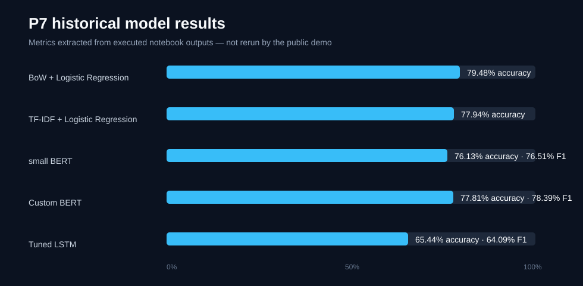

# Sentiment ML Service

An end-to-end, recruiter-friendly example of serving a sentiment model through a tested FastAPI application.

## What it demonstrates

- a clean boundary between inference and HTTP code;
- single and batch predictions;
- model loading once at application startup;
- deterministic local demo requiring no cloud account or private model;
- container health checks and automated tests;
- an upgrade path from the demo baseline to a trained transformer.

```text
client → FastAPI → SentimentService → model adapter → label + score
```

## Run locally

```bash
python -m venv .venv
pip install -e .[dev]
uvicorn sentiment_service.api:app --reload
curl -X POST http://localhost:8000/v1/predict \
  -H "Content-Type: application/json" \
  -d '{"texts":["I loved the clear documentation"]}'
```

Open `http://localhost:8000/docs` for the interactive API.

## Reproducible demo

The default `LexiconModel` is intentionally small and transparent. It is not presented as a production-quality ML model: it makes the API, tests and container fully reproducible. A production adapter can implement the same `SentimentModel` protocol and load a versioned artifact at startup.

## API

- `GET /health` — service readiness;
- `POST /v1/predict` — one or more texts, limited to 100 per request.

## Research case studies

The serving application is the production-facing result of a broader experimental study. Curated notebooks preserve each distinct line of investigation without publishing datasets, trained weights, local paths or experiment logs:

| Case study | Question | Techniques |
|---|---|---|
| [01 — Data preparation](notebooks/01_data_preparation.ipynb) | How should noisy tweets be normalized and split? | quality checks, deterministic split, leakage prevention |
| [02 — Classical baseline](notebooks/02_classical_baseline.ipynb) | How far can a transparent baseline go? | TF-IDF, logistic regression, class metrics |
| [03 — Word embeddings](notebooks/03_word_embeddings.ipynb) | Do learned representations improve the baseline? | Word2Vec/FastText design, OOV analysis |
| [04 — Sequence model](notebooks/04_sequence_model.ipynb) | Can word order improve classification? | Keras, LSTM/BiLSTM, TensorBoard |
| [05 — Transformer](notebooks/05_transformer.ipynb) | What is gained through transfer learning? | BERT-style fine-tuning, latency trade-offs |
| [06 — Experiment tracking](notebooks/06_mlflow_tracking.ipynb) | How can experiments be compared reproducibly? | MLflow parameters, metrics and artifact contract |
| [07 — Historical results](notebooks/07_historical_results.ipynb) | What did the executed experiments actually show? | comparative metrics, learning curves, critical interpretation |

These notebooks consolidate the useful work found across the historical `dev` and `flask` branches, including experimental and advanced-model variants.

## Historical experiment results

The original notebooks contain genuine executed experiments—not only design sketches. The table below reports values preserved in notebook outputs; they are historical observations, not claims reproduced by the lightweight public demo.

| Experiment | Validation | Test | What was learned |
|---|---:|---:|---|
| Bag-of-Words + logistic regression | accuracy 79.72% | accuracy 79.48% | a strong, transparent baseline |
| TF-IDF + logistic regression | accuracy 79.59% | accuracy 77.94% | richer weighting did not automatically improve generalisation |
| small BERT, first implementation | — | accuracy 76.13%, AUC 82.00%, F1 76.51% | transfer learning produced balanced precision/recall |
| custom BERT classifier | — | accuracy 77.81%, AUC 82.95%, F1 78.39% | the strongest documented deep-learning run |
| tuned LSTM/embedding search | — | accuracy 65.44%, F1 64.09%, ROC-AUC 65.45% | very high recall exposed a poorly calibrated decision boundary |



The detailed [experiment inventory](docs/experiment_inventory.md) maps every notebook from `dev` and `flask` to the public portfolio story, including Word2Vec, FastText, LSTM/BiLSTM, convolutional layers, BERT, TensorBoard and MLflow.

## Development

```bash
pytest
ruff check .
docker build -t sentiment-ml-service .
```

## Provenance and safety

This public-ready reconstruction is inspired by the concepts demonstrated in `Projet7` and `p7_api`. It contains no trained model, private dataset, cloud identifier or copied Git history. Sentiment140 can be added later through a documented download-and-training pipeline after dataset-license validation.

## License

Released under the [MIT License](LICENSE).

